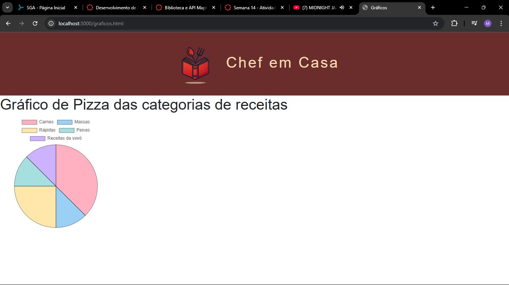
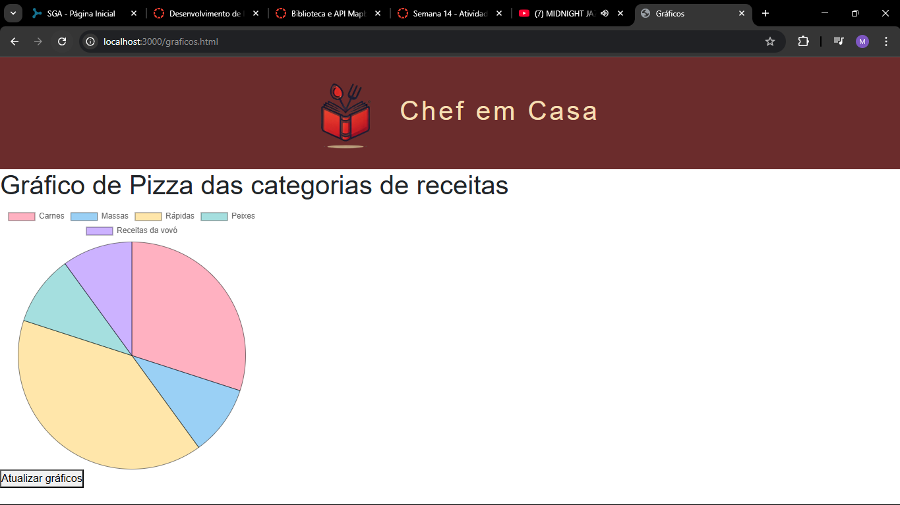

# Trabalho Prático - Semana 14

A partir dos dados cadastrados na etapa anterior, vamos trabalhar formas de apresentação que representem de forma clara e interativa as informações do seu projeto. Você poderá usar gráficos (barra, linha, pizza), mapas, calendários ou outras formas de visualização. Seu desafio é entregar uma página Web que organize, processe e exiba os dados de forma compreensível e esteticamente agradável.

Com base nos tipos de projetos escohidos, você deve propor **visualizações que estimulem a interpretação, agrupamento e exibição criativa dos dados**, trabalhando tanto a lógica quanto o design da aplicação.

Sugerimos o uso das seguintes ferramentas acessíveis: [FullCalendar](https://fullcalendar.io/), [Chart.js](https://www.chartjs.org/), [Mapbox](https://docs.mapbox.com/api/), para citar algumas.

## Informações do trabalho

- Nome: Matheus Henrique Moreira
- Matricula: 878528
- Proposta de projeto escolhida: Diretório de Receitas
- Breve descrição sobre seu projeto: O projeto Chef em Casa é uma aplicação web para cadastro e visualização de receitas. Utiliza HTML, CSS, JavaScript e JSON Server para gerenciar os dados dos pratos, permitindo inserir, editar, excluir e exibir detalhes das receitas. Agora possui gráfico.

**Print da tela com a implementação**

<< Coloque aqui uma breve explicação da implementação feita nessa etapa>>

